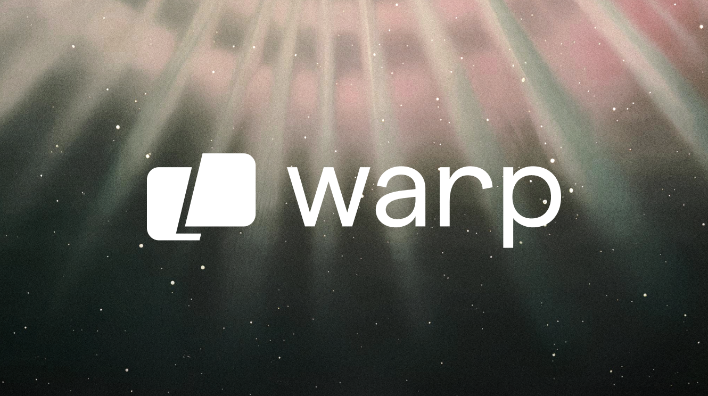

<!-- markdownlint-configure-file {
  "MD013": {
    "code_blocks": false,
    "tables": false
  },
  "MD033": false,
  "MD041": false
} -->

<div align="center">

<sup>Special thanks to:</sup>

<a href="https://www.warp.dev/?utm_source=github&utm_medium=referral&utm_campaign=zoxide_20231001">
  <div>
    
  </div>
  <b>
    Warp is a modern, Rust-based terminal with AI built in so you and your team
    can build great software, faster.
  </b>
  <div>
    <sup>Visit <u>warp.dev</u> to learn more.</sup>
  </div>
</a>

<hr />

# zoxide

[![crates.io][crates.io-badge]][crates.io]
[![Downloads][downloads-badge]][releases]
[![Built with Nix][builtwithnix-badge]][builtwithnix]

zoxide is a **smarter cd command**, inspired by z and autojump.

It remembers which directories you use most frequently, so you can "jump" to
them in just a few keystrokes.<br />
zoxide works on all major shells.

[Getting started](#getting-started) •
[Installation](#installation) •
[Configuration](#configuration) •
[Integrations](#third-party-integrations)

</div>

## Getting started

![Tutorial][tutorial]

```sh
z foo              # cd into highest ranked directory matching foo
z foo bar          # cd into highest ranked directory matching foo and bar
z foo /            # cd into a subdirectory starting with foo

z ~/foo            # z also works like a regular cd command
z foo/             # cd into relative path
z ..               # cd one level up
z -                # cd into previous directory

zi foo             # cd with interactive selection (using fzf)

z foo<SPACE><TAB>  # show interactive completions (zoxide v0.8.0+, bash 4.4+/fish/zsh only)
```

Read more about the matching algorithm [here][algorithm-matching].

## Installation

zoxide can be installed in 4 easy steps:

1. **Install binary**

   zoxide runs on most major platforms. If your platform isn't listed below,
   please [open an issue][issues].

   <details>
   <summary>Linux / WSL</summary>

   > The recommended way to install zoxide is via the install script:
   >
   > ```sh
   > curl -sS https://raw.githubusercontent.com/ajeetdsouza/zoxide/main/install.sh | bash
   > ```
   >
   > Or, you can use a package manager:
   >
   > | Distribution        | Repository              | Instructions                                                                                          |
   > | ------------------- | ----------------------- | ----------------------------------------------------------------------------------------------------- |
   > | **_Any_**           | **[crates.io]**         | `cargo install zoxide --locked`                                                                       |
   > | _Any_               | [asdf]                  | `asdf plugin add zoxide https://github.com/nyrst/asdf-zoxide.git` <br /> `asdf install zoxide latest` |
   > | _Any_               | [conda-forge]           | `conda install -c conda-forge zoxide`                                                                 |
   > | _Any_               | [guix]                  | `guix install zoxide`                                                                                 |
   > | _Any_               | [Linuxbrew]             | `brew install zoxide`                                                                                 |
   > | _Any_               | [nixpkgs]               | `nix-env -iA nixpkgs.zoxide`                                                                          |
   > | Alpine Linux 3.13+  | [Alpine Linux Packages] | `apk add zoxide`                                                                                      |
   > | Arch Linux          | [Arch Linux Extra]      | `pacman -S zoxide`                                                                                    |
   > | CentOS 7+           | [Copr]                  | `dnf copr enable atim/zoxide` <br /> `dnf install zoxide`                                             |
   > | ~Debian 11+~[^1]    | ~[Debian Packages]~     | ~`apt install zoxide`~                                                                                |
   > | Devuan 4.0+         | [Devuan Packages]       | `apt install zoxide`                                                                                  |
   > | Fedora 32+          | [Fedora Packages]       | `dnf install zoxide`                                                                                  |
   > | Gentoo              | [GURU Overlay]          | `eselect repository enable guru` <br /> `emerge --sync guru` <br /> `emerge app-shells/zoxide`        |
   > | Manjaro             |                         | `pacman -S zoxide`                                                                                    |
   > | openSUSE Tumbleweed | [openSUSE Factory]      | `zypper install zoxide`                                                                               |
   > | ~Parrot OS~[^1]     |                         | ~`apt install zoxide`~                                                                                |
   > | ~Raspbian 11+~[^1]  | ~[Raspbian Packages]~   | ~`apt install zoxide`~                                                                                |
   > | Rhino Linux         | [Pacstall Packages]     | `pacstall -I zoxide-deb`                                                                              |
   > | Slackware 15.0+     | [SlackBuilds]           | [Instructions][slackbuilds-howto]                                                                     |
   > | Solus               | [Solus Packages]        | `eopkg install zoxide`                                                                                |
   > | ~Ubuntu 21.04+~[^1] | ~[Ubuntu Packages]~     | ~`apt install zoxide`~                                                                                |
   > | Void Linux          | [Void Linux Packages]   | `xbps-install -S zoxide`                                                                              |

   </details>

   <details>
   <summary>macOS</summary>

   > To install zoxide, use a package manager:
   >
   > | Repository      | Instructions                                                                                          |
   > | --------------- | ----------------------------------------------------------------------------------------------------- |
   > | **[crates.io]** | `cargo install zoxide --locked`                                                                       |
   > | **[Homebrew]**  | `brew install zoxide`                                                                                 |
   > | [asdf]          | `asdf plugin add zoxide https://github.com/nyrst/asdf-zoxide.git` <br /> `asdf install zoxide latest` |
   > | [conda-forge]   | `conda install -c conda-forge zoxide`                                                                 |
   > | [MacPorts]      | `port install zoxide`                                                                                 |
   > | [nixpkgs]       | `nix-env -iA nixpkgs.zoxide`                                                                          |
   >
   > Or, run this command in your terminal:
   >
   > ```sh
   > curl -sS https://raw.githubusercontent.com/ajeetdsouza/zoxide/main/install.sh | bash
   > ```

   </details>

   <details>
   <summary>Windows</summary>

   > zoxide works with PowerShell, as well as shells running in Cygwin, Git
   > Bash, and MSYS2.
   >
   > The recommended way to install zoxide is via `winget`:
   >
   > ```sh
   > winget install ajeetdsouza.zoxide
   > ```
   >
   > Or, you can use an alternative package manager:
   >
   > | Repository      | Instructions                          |
   > | --------------- | ------------------------------------- |
   > | **[crates.io]** | `cargo install zoxide --locked`       |
   > | [Chocolatey]    | `choco install zoxide`                |
   > | [conda-forge]   | `conda install -c conda-forge zoxide` |
   > | [Scoop]         | `scoop install zoxide`                |

   </details>

   <details>
   <summary>BSD</summary>

   > To install zoxide, use a package manager:
   >
   > | Distribution  | Repository      | Instructions                    |
   > | ------------- | --------------- | ------------------------------- |
   > | **_Any_**     | **[crates.io]** | `cargo install zoxide --locked` |
   > | DragonFly BSD | [DPorts]        | `pkg install zoxide`            |
   > | FreeBSD       | [FreshPorts]    | `pkg install zoxide`            |
   > | NetBSD        | [pkgsrc]        | `pkgin install zoxide`          |
   >
   > Or, run this command in your terminal:
   >
   > ```sh
   > curl -sS https://raw.githubusercontent.com/ajeetdsouza/zoxide/main/install.sh | bash
   > ```

   </details>

   <details>
   <summary>Android</summary>

   > To install zoxide, use a package manager:
   >
   > | Repository | Instructions         |
   > | ---------- | -------------------- |
   > | [Termux]   | `pkg install zoxide` |

   </details>

2. **Setup zoxide on your shell**

   To start using zoxide, add it to your shell.

   <details>
   <summary>Bash</summary>

   > Add this to the **end** of your config file (usually `~/.bashrc`):
   >
   > ```sh
   > eval "$(zoxide init bash)"
   > ```

   </details>

   <details>
   <summary>Elvish</summary>

   > Add this to the **end** of your config file (usually `~/.elvish/rc.elv`):
   >
   > ```sh
   > eval (zoxide init elvish | slurp)
   > ```
   >
   > **Note**
   > zoxide only supports elvish v0.18.0 and above.

   </details>

   <details>
   <summary>Fish</summary>

   > Add this to the **end** of your config file (usually
   > `~/.config/fish/config.fish`):
   >
   > ```fish
   > zoxide init fish | source
   > ```

   </details>

   <details>
   <summary>Nushell</summary>

   > Add this to the **end** of your env file (find it by running `$nu.env-path`
   > in Nushell):
   >
   > ```sh
   > zoxide init nushell | save -f ~/.zoxide.nu
   > ```
   >
   > Now, add this to the **end** of your config file (find it by running
   > `$nu.config-path` in Nushell):
   >
   > ```sh
   > source ~/.zoxide.nu
   > ```
   >
   > **Note**
   > zoxide only supports Nushell v0.89.0+.

   </details>

   <details>
   <summary>PowerShell</summary>

   > Add this to the **end** of your config file (find it by running
   > `echo $profile` in PowerShell):
   >
   > ```powershell
   > Invoke-Expression (& { (zoxide init powershell | Out-String) })
   > ```

   </details>

   <details>
   <summary>Xonsh</summary>

   > Add this to the **end** of your config file (usually `~/.xonshrc`):
   >
   > ```python
   > execx($(zoxide init xonsh), 'exec', __xonsh__.ctx, filename='zoxide')
   > ```

   </details>

   <details>
   <summary>Zsh</summary>

   > Add this to the **end** of your config file (usually `~/.zshrc`):
   >
   > ```sh
   > eval "$(zoxide init zsh)"
   > ```
   >
   > For completions to work, the above line must be added _after_ `compinit` is
   > called. You may have to rebuild your completions cache by running
   > `rm ~/.zcompdump*; compinit`.

   </details>

   <details>
   <summary>Any POSIX shell</summary>

   > Add this to the **end** of your config file:
   >
   > ```sh
   > eval "$(zoxide init posix --hook prompt)"
   > ```

   </details>

3. **Install fzf** <sup>(optional)</sup>

   [fzf] is a command-line fuzzy finder, used by zoxide for completions /
   interactive selection. It can be installed from [here][fzf-installation].

   > **Note**
   > zoxide only supports fzf v0.33.0 and above.

4. **Import your data** <sup>(optional)</sup>

   If you currently use any of these plugins, you may want to import your data
   into zoxide:

   <details>
   <summary>autojump</summary>

   > Run this command in your terminal:
   >
   > ```sh
   > zoxide import --from=autojump "/path/to/autojump/db"
   > ```
   >
   > The path usually varies according to your system:
   >
   > | OS      | Path                                                                                 | Example                                                |
   > | ------- | ------------------------------------------------------------------------------------ | ------------------------------------------------------ |
   > | Linux   | `$XDG_DATA_HOME/autojump/autojump.txt` or `$HOME/.local/share/autojump/autojump.txt` | `/home/alice/.local/share/autojump/autojump.txt`       |
   > | macOS   | `$HOME/Library/autojump/autojump.txt`                                                | `/Users/Alice/Library/autojump/autojump.txt`           |
   > | Windows | `%APPDATA%\autojump\autojump.txt`                                                    | `C:\Users\Alice\AppData\Roaming\autojump\autojump.txt` |

   </details>

   <details>
   <summary>fasd, z, z.lua, zsh-z</summary>

   > Run this command in your terminal:
   >
   > ```sh
   > zoxide import --from=z "path/to/z/db"
   > ```
   >
   > The path usually varies according to your system:
   >
   > | Plugin           | Path                                                                                |
   > | ---------------- | ----------------------------------------------------------------------------------- |
   > | fasd             | `$_FASD_DATA` or `$HOME/.fasd`                                                      |
   > | z (bash/zsh)     | `$_Z_DATA` or `$HOME/.z`                                                            |
   > | z (fish)         | `$Z_DATA` or `$XDG_DATA_HOME/z/data` or `$HOME/.local/share/z/data`                 |
   > | z.lua (bash/zsh) | `$_ZL_DATA` or `$HOME/.zlua`                                                        |
   > | z.lua (fish)     | `$XDG_DATA_HOME/zlua/zlua.txt` or `$HOME/.local/share/zlua/zlua.txt` or `$_ZL_DATA` |
   > | zsh-z            | `$ZSHZ_DATA` or `$_Z_DATA` or `$HOME/.z`                                            |

   </details>

   <details>
   <summary>ZLocation</summary>

   > Run this command in PowerShell:
   >
   > ```powershell
   > $db = New-TemporaryFile
   > (Get-ZLocation).GetEnumerator() | ForEach-Object { Write-Output ($_.Name+'|'+$_.Value+'|0') } | Out-File $db
   > zoxide import --from=z $db
   > ```

   </details>

## Configuration

### Flags

When calling `zoxide init`, the following flags are available:

- `--cmd`
  - Changes the prefix of the `z` and `zi` commands.
  - `--cmd j` would change the commands to (`j`, `ji`).
  - `--cmd cd` would replace the `cd` command.
- `--hook <HOOK>`
  - Changes how often zoxide increments a directory's score:
    | Hook     | Description                       |
    | -------- | --------------------------------- |
    | `none`   | Never                             |
    | `prompt` | At every shell prompt             |
    | `pwd`    | Whenever the directory is changed |
- `--no-cmd`
  - Prevents zoxide from defining the `z` and `zi` commands.
  - These functions will still be available in your shell as `__zoxide_z` and
    `__zoxide_zi`, should you choose to redefine them.

### Environment variables

Environment variables[^2] can be used for configuration. They must be set before
`zoxide init` is called.

- `_ZO_DATA_DIR`
  - Specifies the directory in which the database is stored.
  - The default value varies across OSes:
    | OS          | Path                                     | Example                                    |
    | ----------- | ---------------------------------------- | ------------------------------------------ |
    | Linux / BSD | `$XDG_DATA_HOME` or `$HOME/.local/share` | `/home/alice/.local/share`                 |
    | macOS       | `$HOME/Library/Application Support`      | `/Users/Alice/Library/Application Support` |
    | Windows     | `%LOCALAPPDATA%`                         | `C:\Users\Alice\AppData\Local`             |
- `_ZO_ECHO`
  - When set to 1, `z` will print the matched directory before navigating to
    it.
- `_ZO_EXCLUDE_DIRS`
  - Excludes the specified directories from the database.
  - This is provided as a list of [globs][glob], separated by OS-specific
    characters:
    | OS                  | Separator | Example                 |
    | ------------------- | --------- | ----------------------- |
    | Linux / macOS / BSD | `:`       | `$HOME:$HOME/private/*` |
    | Windows             | `;`       | `$HOME;$HOME/private/*` |
  - By default, this is set to `"$HOME"`.
- `_ZO_FZF_OPTS`
  - Custom options to pass to [fzf] during interactive selection. See
    [`man fzf`][fzf-man] for the list of options.
- `_ZO_MAXAGE`
  - Configures the [aging algorithm][algorithm-aging], which limits the maximum
    number of entries in the database.
  - By default, this is set to 10000.
- `_ZO_RESOLVE_SYMLINKS`
  - When set to 1, `z` will resolve symlinks before adding directories to the
    database.

## Third-party integrations

| Application           | Description                                  | Plugin                     |
| --------------------- | -------------------------------------------- | -------------------------- |
| [aerc]                | Email client                                 | Natively supported         |
| [clink]               | Improved cmd.exe for Windows                 | [clink-zoxide]             |
| [emacs]               | Text editor                                  | [zoxide.el]                |
| [felix]               | File manager                                 | Natively supported         |
| [joshuto]             | File manager                                 | Natively supported         |
| [lf]                  | File manager                                 | See the [wiki][lf-wiki]    |
| [nnn]                 | File manager                                 | [nnn-autojump]             |
| [ranger]              | File manager                                 | [ranger-zoxide]            |
| [telescope.nvim]      | Fuzzy finder for Neovim                      | [telescope-zoxide]         |
| [t]                   | `tmux` session manager                       | Natively supported         |
| [tmux-session-wizard] | `tmux` session manager                       | Natively supported         |
| [vim] / [neovim]      | Text editor                                  | [zoxide.vim]               |
| [xplr]                | File manager                                 | [zoxide.xplr]              |
| [xxh]                 | Transports shell configuration over SSH      | [xxh-plugin-prerun-zoxide] |
| [zabb]                | Finds the shortest possible query for a path | Natively supported         |
| [zsh-autocomplete]    | Realtime completions for zsh                 | Natively supported         |

[^1]:
    Debian / Ubuntu derivatives update their packages very slowly. If you're
    using one of these distributions, consider using the install script instead.

[^2]:
    If you're not sure how to set an environment variable on your shell, check
    out the [wiki][wiki-env].

[aerc]: https://github.com/rjarry/aerc
[algorithm-aging]: https://github.com/ajeetdsouza/zoxide/wiki/Algorithm#aging
[algorithm-matching]: https://github.com/ajeetdsouza/zoxide/wiki/Algorithm#matching
[alpine linux packages]: https://pkgs.alpinelinux.org/packages?name=zoxide
[arch linux extra]: https://archlinux.org/packages/extra/x86_64/zoxide/
[asdf]: https://github.com/asdf-vm/asdf
[builtwithnix-badge]: https://img.shields.io/badge/builtwith-nix-7d81f7?logo=nixos&logoColor=white&style=flat-square
[builtwithnix]: https://builtwithnix.org/
[chocolatey]: https://community.chocolatey.org/packages/zoxide
[clink-zoxide]: https://github.com/shunsambongi/clink-zoxide
[clink]: https://github.com/mridgers/clink
[conda-forge]: https://anaconda.org/conda-forge/zoxide
[copr]: https://copr.fedorainfracloud.org/coprs/atim/zoxide/
[crates.io-badge]: https://img.shields.io/crates/v/zoxide?logo=rust&logoColor=white&style=flat-square
[crates.io]: https://crates.io/crates/zoxide
[debian packages]: https://packages.debian.org/stable/admin/zoxide
[devuan packages]: https://pkginfo.devuan.org/cgi-bin/package-query.html?c=package&q=zoxide
[downloads-badge]: https://img.shields.io/github/downloads/ajeetdsouza/zoxide/total?logo=github&logoColor=white&style=flat-square
[dports]: https://github.com/DragonFlyBSD/DPorts/tree/master/sysutils/zoxide
[emacs]: https://www.gnu.org/software/emacs/
[fedora packages]: https://src.fedoraproject.org/rpms/rust-zoxide
[felix]: https://github.com/kyoheiu/felix
[freshports]: https://www.freshports.org/sysutils/zoxide/
[fzf-installation]: https://github.com/junegunn/fzf#installation
[fzf-man]: https://manpages.ubuntu.com/manpages/en/man1/fzf.1.html
[fzf]: https://github.com/junegunn/fzf
[glob]: https://man7.org/linux/man-pages/man7/glob.7.html
[guix]: https://packages.guix.gnu.org/packages/zoxide/
[guru overlay]: https://github.com/gentoo-mirror/guru
[homebrew]: https://formulae.brew.sh/formula/zoxide
[issues]: https://github.com/ajeetdsouza/zoxide/issues/new
[joshuto]: https://github.com/kamiyaa/joshuto
[lf]: https://github.com/gokcehan/lf
[lf-wiki]: https://github.com/gokcehan/lf/wiki/Integrations#zoxide
[linuxbrew]: https://formulae.brew.sh/formula-linux/zoxide
[macports]: https://ports.macports.org/port/zoxide/summary
[neovim]: https://github.com/neovim/neovim
[nixpkgs]: https://github.com/NixOS/nixpkgs/blob/master/pkgs/tools/misc/zoxide/default.nix
[nnn-autojump]: https://github.com/jarun/nnn/blob/master/plugins/autojump
[nnn]: https://github.com/jarun/nnn
[opensuse factory]: https://build.opensuse.org/package/show/openSUSE:Factory/zoxide
[pacstall packages]: https://pacstall.dev/packages/zoxide-deb
[pkgsrc]: https://pkgsrc.se/sysutils/zoxide
[ranger-zoxide]: https://github.com/jchook/ranger-zoxide
[ranger]: https://github.com/ranger/ranger
[raspbian packages]: https://archive.raspbian.org/raspbian/pool/main/r/rust-zoxide/
[releases]: https://github.com/ajeetdsouza/zoxide/releases
[scoop]: https://github.com/ScoopInstaller/Main/tree/master/bucket/zoxide.json
[slackbuilds]: https://slackbuilds.org/repository/15.0/system/zoxide/
[slackbuilds-howto]: https://slackbuilds.org/howto/
[solus packages]: https://github.com/getsolus/packages/tree/main/packages/z/zoxide/
[t]: https://github.com/joshmedeski/t-smart-tmux-session-manager
[telescope-zoxide]: https://github.com/jvgrootveld/telescope-zoxide
[telescope.nvim]: https://github.com/nvim-telescope/telescope.nvim
[termux]: https://github.com/termux/termux-packages/tree/master/packages/zoxide
[tmux-session-wizard]: https://github.com/27medkamal/tmux-session-wizard
[tutorial]: contrib/tutorial.webp
[ubuntu packages]: https://packages.ubuntu.com/jammy/zoxide
[vim]: https://github.com/vim/vim
[void linux packages]: https://github.com/void-linux/void-packages/tree/master/srcpkgs/zoxide
[wiki-env]: https://github.com/ajeetdsouza/zoxide/wiki/HOWTO:-set-environment-variables "HOWTO: set environment variables"
[xplr]: https://github.com/sayanarijit/xplr
[xxh-plugin-prerun-zoxide]: https://github.com/xxh/xxh-plugin-prerun-zoxide
[xxh]: https://github.com/xxh/xxh
[zabb]: https://github.com/Mellbourn/zabb
[zoxide.el]: https://gitlab.com/Vonfry/zoxide.el
[zoxide.vim]: https://github.com/nanotee/zoxide.vim
[zoxide.xplr]: https://github.com/sayanarijit/zoxide.xplr
[zsh-autocomplete]: https://github.com/marlonrichert/zsh-autocomplete
